# 🧘 ZenExport for Fusion 360

**Turn your frantic file juggling into a calm, automated zen garden.**

Tired of the "10 Document Limit"? Hate manually exporting STLs? **ZenExport** is your answer. It is the "Save As" feature Fusion 360 forgot.

---

## ✨ Features that Spark Joy

### ⏳ Time Machine (Auto-Versioning)

Never fear "saving over" a good design again. We automatically keep a history of your source files.

- `Project_v01.f3d` ... `Project_v05.f3d`
- We manage the messy version numbers so you don't have to!

### 🔄 Synchronized Save

One click exports **EVERYTHING**:

- **Native Archive (.f3d)** - For full history playback.
- **Universal CAD (.step)** - For sharing with SolidWorks/Onshape friends.
- **Mesh Files (.stl)** - Every body, individually exported, ready for slicing.

### 🖼️ Visual Previews

"Which file was this again?"
We take a snapshot of your viewport and save it as `_preview.png` right in the folder. No more guessing!

### 📂 Instant Access

The second the export catches its breath, we pop open the folder for you. Drag. Drop. Print. Done.

### 🧠 Smart Memory

We remember where you last saved your project. Run the script again, and it just _knows_—updating your files silently in the background.

---

## 🏗️ The Structure

We organize your files with obsessive-compulsive precision:

```mermaid
graph TD
    Root[📂 MyProject] --> Preview[🖼️ _preview.png]
    Root --> CAD[📂 CAD]
    Root --> Models[📂 Models]

    CAD --> V1[📂 v01]
    CAD --> V2[📂 v02]

    V1 --> F3D_V1[📄 Project_v01.f3d]
    V1 --> STP_V1[⚙️ Project_v01.step]

    V2 --> F3D_V2[📄 Project_v02.f3d]
    V2 --> STP_V2[⚙️ Project_v02.step]

    Models --> Body1[🧊 Body1.stl]
    Models --> Body2[🧊 Body2.stl]

    style Root fill:#f9f,stroke:#333
    style V2 fill:#bbf,stroke:#333
    style Models fill:#bfb,stroke:#333
```

---

## 🚀 Installation

1.  **Download** this repository (Click the green `<> Code` button and `Download ZIP`).
2.  **Unzip** it. You should have a folder named `ZenExport`.
3.  **Move** that folder here:
    - **Windows:** `%appdata%\Autodesk\Autodesk Fusion 360\API\Scripts\`
    - **Mac:** `~/Library/Application Support/Autodesk/Autodesk Fusion 360/API/Scripts/`
4.  **Restart** Fusion 360.

_(Pro Tip: You can just copy-paste `%appdata%\Autodesk\Autodesk Fusion 360\API\Scripts\` into your Windows File Explorer address bar to find the spot!)_

---

## 🎮 How to Use

1.  Open your design in Fusion 360.
2.  Press **Shift+S** (or go to `Extensions` > `Scripts & Add-Ins`).
3.  Find **ZenExport** under "My Scripts" and click **Run**.
4.  **First Run:** It will ask you where to save.
5.  **Next Runs:** It just works. Updates happen silently.
6.  **Need a Reset?** Hold **Shift** while clicking Run to pick a new folder.

---

### ❤️ Contributing

Found a bug? Have a cooler idea? Fork it!
This script was built with love (and a lot of Python) to make the Maker community just a little bit happier.

**Happy Making!** 🛠️
